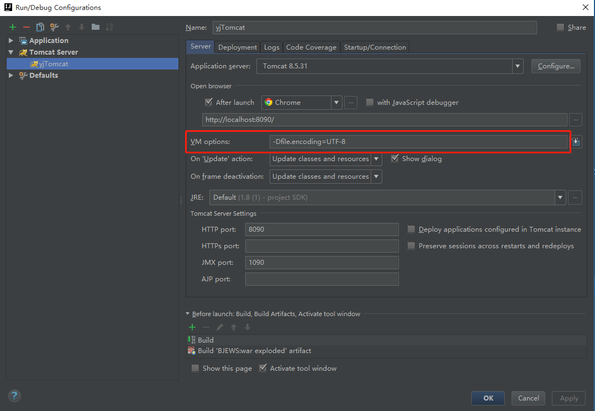
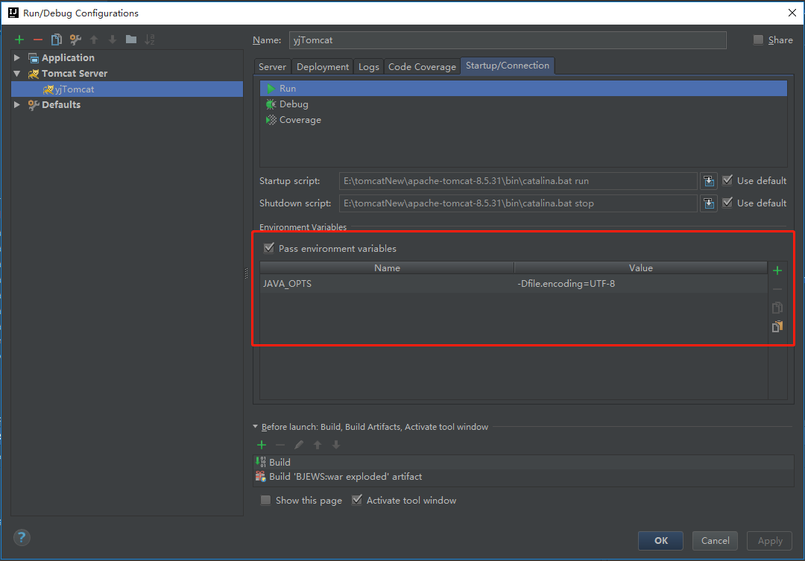

1.进入tomcat配置Run/Debug Configurations中，在VM options中填入-Dfile.encoding=UTF-8

2.大部分情况配置一即可解决，如乱码问题未解决请继续配置二。进入tomcat配置Run/Debug Configurations中，进入Startup/Connection配置面板中，勾选Pass environment variables选项，并添加一个environment variables，Name填写JAVA_TOOL_OPTINS,Value填-Dfile.encoding=UTF-8

