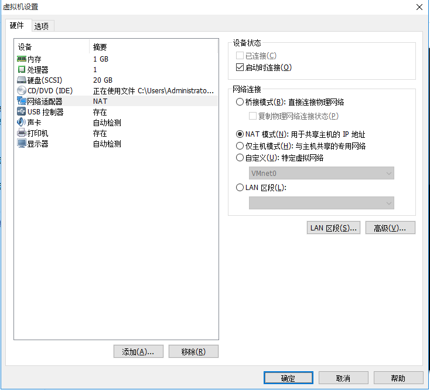
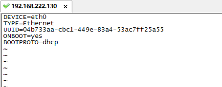

1.设置虚拟机的网络适配器模式为NAT模式
 

2.进入系统，修改网络配置文件

    vi /etc/sysconfig/network-scripts/ifcfg-eth0   进入配置文件

3.删除其中的mac地址并修改ip获取方式BOOTPROTO为dhcp动态获取，是否允许ONBOOT修改为yes

4.删除网卡配置信息 

    rm -rf /etc/udev/rules.d/70-persistent-net.rules

5.重启虚拟机

    reboot

6.查看当前虚拟机ip地址
    
    ifconfig